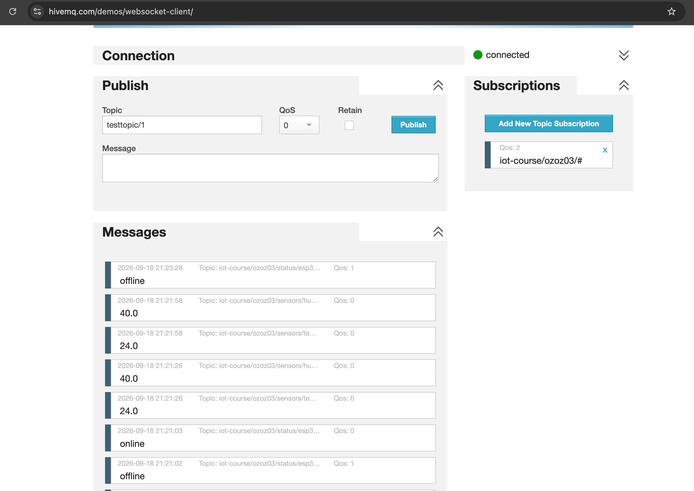
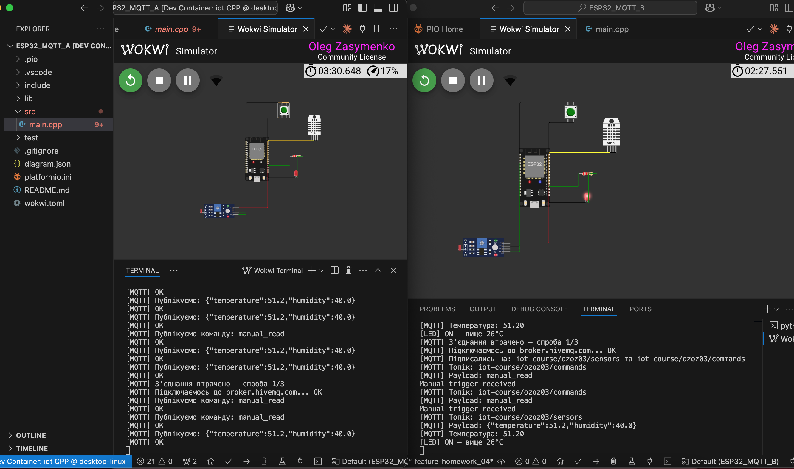

# Лекція 8 — Практичне застосування MQTT

Два ESP32 спілкуються через публічний MQTT брокер без прямого з'єднання між собою. ESP32-A читає сенсори і публікує дані. ESP32-B підписується на топік і керує LED актуатором на основі отриманих значень.

---

## Архітектура

```
ESP32-A (Publisher)          broker.hivemq.com          ESP32-B (Subscriber)
┌─────────────────┐          ┌─────────────┐          ┌─────────────────┐
│ DHT22           │          │             │          │ LED актуатор     │
│ температура     │─publish──►    Broker   ──deliver──►                 │
│ вологість       │          │             │          │ >26°C → LED ON  │
└─────────────────┘          └─────────────┘          │ <20°C → LED OFF │
                                                       └─────────────────┘
```

---

## Структура проєктів

```
homework_04/
├── README.md                ← цей файл
├── ESP32_MQTT_A/            ← Publisher: підключення + публікація
│   ├── README.md
│   ├── src/main.cpp
│   ├── diagram.json
│   ├── wokwi.toml
│   └── platformio.ini
└── ESP32_MQTT_B/            ← Subscriber: підписка + callback + LED
    ├── README.md
    ├── src/main.cpp
    ├── diagram.json
    ├── wokwi.toml
    └── platformio.ini
```

---

## Топіки

| Топік | Хто публікує | Хто підписаний |
|---|---|---|
| `iot-course/ozoz03/sensors/temperature` | ESP32-A | ESP32-B |

---

## Моніторинг через HiveMQ веб-клієнт

URL: `hivemq.com/demos/websocket-client`

### Параметри підключення

| Поле | Значення |
|---|---|
| Host | `broker.hivemq.com` |
| Port | `8884` |
| ClientID | автогенерований — не змінювати |
| Keep Alive | `60` |
| SSL | увімкнено |
| Clean Session | увімкнено |

### Кроки

1. Відкрити `hivemq.com/demos/websocket-client`
2. Переконатись що Host: `broker.hivemq.com`, Port: `8884`
3. Натиснути **Connect** — дочекатись зеленої крапки `connected`
4. Натиснути **Add New Topic Subscription**
5. Topic: `iot-course/ozoz03/#`, QoS: `0` → **Subscribe**
6. Запустити симуляцію в Wokwi — повідомлення з'являться в секції **Messages**

### Відомий баг

При натисканні **Subscribe** може з'явитись popup `www.hivemq.com says: Not connected` — це баг самого веб-клієнта HiveMQ, не помилка в коді. Закрити popup кнопкою **OK** — підписка все одно активується і повідомлення надходитимуть.

---

## Домашнє завдання 4

### Завдання

**ESP32-A (сенсор):** DHT22 + кнопка
- Публікувати температуру і вологість на топік `iot-course/<ваше_ім'я>/sensors` раз на 10 секунд
- При натисканні кнопки — опублікувати `"manual_read"` на топік `iot-course/<ваше_ім'я>/commands`

**ESP32-B (актуатор):** LED
- Підписатись на `iot-course/<ваше_ім'я>/sensors`
- Якщо температура > 26°C — увімкнути LED
- Якщо температура < 20°C — вимкнути LED
- Підписатись на `iot-course/<ваше_ім'я>/commands` і реагувати на `"manual_read"` — блимнути LED 3 рази + вивести в Serial `"Manual trigger received"`

### Вимоги

- Використати публічний брокер: `test.mosquitto.org` або `broker.hivemq.com`
- Обробити втрату з'єднання — reconnect через 5 секунд, максимум 3 спроби
- ESP32-B використовує QoS 1 для subscribe

### Ієрархія топіків

```
iot-course/<ваше_ім'я>/sensors/temperature
iot-course/<ваше_ім'я>/sensors/humidity
iot-course/<ваше_ім'я>/actuators/led
iot-course/<ваше_ім'я>/status
```

### Моніторинг

Встановити **MQTT Explorer** (desktop) або **MQTT Dashboard** (Android), підключитись до брокера, підписатись на `iot-course/<ваше_ім'я>/#` і зробити скріншот з історією повідомлень.

### Критерії здачі

- Обидва ESP32 працюють одночасно
- Є retry-логіка (максимум 3 спроби)
- README з описом архітектури та скріншотами

---

## Реалізація ДЗ4

### Архітектура

```
ESP32-A (DHT22 + кнопка)              broker.hivemq.com              ESP32-B (LED)
┌─────────────────────┐               ┌─────────────┐               ┌─────────────────────┐
│ DHT22 → t, h         │──publish────▶│             │──deliver─────▶│ t>26°C → LED ON      │
│ (кожні 10с,          │  sensors/*    │             │  sensors/     │ t<20°C → LED OFF     │
│  окремі підтопіки)   │               │             │  temperature  │  → publish            │
│                      │               │   Broker    │               │    actuators/led      │
│ Кнопка (debounce)    │──publish────▶│             │──deliver─────▶│ "manual_read" →       │
│ → "manual_read"      │  commands     │             │  commands     │ blink LED x3          │
│                      │               │             │               │                      │
│ LWT → offline        │──publish────▶│             │◀─────publish──│ LWT → offline         │
│ (online при connect) │  status/a     │             │  status/b     │ (online при connect)  │
└─────────────────────┘               └─────────────┘               └─────────────────────┘
```

Топіки використовують префікс `iot-course/ozoz03` (нік автора) з ієрархією за призначенням (окремі підтопіки на кожен показник — можна підписатись без розбору JSON; `status` разом з LWT показує, чи пристрій онлайн):

| Топік | Хто публікує | Хто підписаний | Payload |
|---|---|---|---|
| `iot-course/ozoz03/sensors/temperature` | ESP32-A (кожні 10с) | ESP32-B (subscribe QoS 1*) | `24.5` |
| `iot-course/ozoz03/sensors/humidity` | ESP32-A (кожні 10с) | — | `55.0` |
| `iot-course/ozoz03/commands` | ESP32-A (на натискання кнопки) | ESP32-B (subscribe QoS 1*) | `manual_read` |
| `iot-course/ozoz03/actuators/led` | ESP32-B (при зміні стану LED) | — | `ON` / `OFF` (retained) |
| `iot-course/ozoz03/status/esp32-a` | ESP32-A (online при connect, LWT offline) | — | `online` / `offline` (retained) |
| `iot-course/ozoz03/status/esp32-b` | ESP32-B (online при connect, LWT offline) | — | `online` / `offline` (retained) |

\* B викликає `subscribe(topic, 1)`, але фактична доставка — **QoS 0**, не гарантована: брокер доставляє повідомлення з мінімумом {QoS публікації, QoS підписки}, а `PubSubClient::publish()` завжди публікує на QoS 0 (параметра QoS у нього немає). `subscribe(..., 1)` тут коректний, просто не змінює фактичний рівень доставки, поки видавець сам не публікує на QoS ≥ 1 — а PubSubClient так не вміє.

**Retry-логіка** (обидва пристрої, `maintainConnection()` у `loop()`, без `delay()`): при втраті з'єднання — reconnect раз на 5 секунд, максимум 3 спроби поспіль; якщо цикл спроб вичерпано — пауза 60 секунд, потім лічильник скидається і починається новий цикл (пристрій не зависає офлайн назавжди). Якщо причина саме у відсутньому Wi-Fi — MQTT-спроби не витрачаються, натомість неблокуючий `WiFi.reconnect()`.

**Blink на ESP32-B** реалізовано неблокуюче: `onMessage()` лише виставляє прапорець, саме перемикання LED (3 рази ON/OFF) виконує `handleBlink()` у `loop()` через `millis()`.

Деталі кожного проєкту — `ESP32_MQTT_A/README.md` та `ESP32_MQTT_B/README.md`.

### Скріншоти



---

## Залежності

Обидва проєкти:

```ini
lib_deps =
    knolleary/PubSubClient
```

ESP32_MQTT_A додатково (читає DHT22 — B цю бібліотеку не підключає, LED не потребує):

```ini
lib_deps =
    adafruit/DHT sensor library
```

---

## Порядок запуску

1. Запустити **ESP32-A** у Wokwi — дочекатись `[MQTT] OK` у Serial
2. Відкрити HiveMQ веб-клієнт — підписатись на `iot-course/ozoz03/#`
3. Запустити **ESP32-B** у другому вікні Wokwi
4. ESP32-B отримує повідомлення від ESP32-A і керує LED

---

## Що робить кожен проєкт

### ESP32_MQTT_A — Publisher
- Підключається до Wi-Fi і MQTT брокера (з LWT — `status/esp32-a` → `offline` при нештатному розриві)
- Публікує температуру і вологість окремими повідомленнями (`sensors/temperature`, `sensors/humidity`) раз на 10 секунд
- Автоматичний reconnect через `millis()` — без `delay()`
- Детальніше: `ESP32_MQTT_A/README.md`

### ESP32_MQTT_B — Subscriber
- Підключається до Wi-Fi і MQTT брокера (з LWT — `status/esp32-b` → `offline` при нештатному розриві)
- Підписується на `sensors/temperature` та `commands` від ESP32-A
- Callback `onMessage()` автоматично спрацьовує при вхідному повідомленні
- Читає температуру напряму через `atof()` — без розбору JSON, топік уже містить лише число
- Вмикає LED якщо температура > 26°C, вимикає якщо < 20°C; публікує новий стан у `actuators/led` (retained)
- Детальніше: `ESP32_MQTT_B/README.md`

---

## Рекомендована література

| Ресурс | Посилання |
|---|---|
| PubSubClient | [pubsubclient.knolleary.net](https://pubsubclient.knolleary.net) |
| HiveMQ публічний брокер | [hivemq.com/mqtt/public-mqtt-broker](https://www.hivemq.com/mqtt/public-mqtt-broker) |
| MQTT Essentials серія | [hivemq.com/blog/mqtt-essentials-part-1-introducing-mqtt](https://www.hivemq.com/blog/mqtt-essentials-part-1-introducing-mqtt/) |
| MQTT Explorer | [mqtt-explorer.com](https://mqtt-explorer.com) |
| Wokwi Wi-Fi | [docs.wokwi.com/guides/esp32-wifi](https://docs.wokwi.com/guides/esp32-wifi) |



