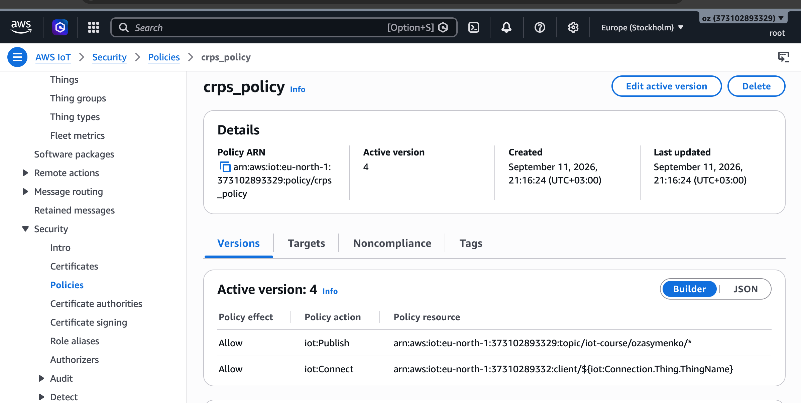

#  Домашня робота 5 — Обробка даних у хмарі: Rules Engine

---

## Архітектурна схема

```
┌──────────────┐
│  ESP32       │  Wokwi
│  (DHT22 sim) │
└──────┬───────┘
       │ MQTT over TLS, порт 8883
       │ топік: iot-course/ozasymenko/sensors/data
       │ payload: {"device_id","timestamp","temperature","humidity","lux"}
       ▼
┌──────────────────────────────────────────────────────────────────────────────┐
│  AWS IoT Core (eu-north-1)                                                   │
│  ┌───────────────────────────────────────────────────────────┐               │
│  │  Rules Engine                                             │               │
│  │┌─────────────────────────┐  ┌────────────────────────────┐│               │
│  ││StoreTelemetry           │  │ TemperatureMoreThan28      ││               │
│  ││  SELECT * + timestamp() │  │  SELECT *                  ││               │
│  ││           + clientid()  │  │     WHERE temperature > 28 ││               │
│  ││           + topic(2)    │  │                            ││               │
│  │└───────────┬─────────────┘  └─────────────────────────┬──┘│               │               
│  └────────────┼──────────────────────────────────────────┼───┘               │
└───────────────┼──────────────────────────────────────────┼───────────────────┘
                │ дія dynamoDBv2                           │
                │ IAM-роль: iot_write_db                   │
                │                                          │
                ├─────────────[on error]─────┐             └───────┐         
                ▼                            │                     │
        ┌───────────────────┐              ┌─┼─────────────────────┼───────────────────┐       
        │  DynamoDB         │              │ │ ClaudWatch          │                   │
        │                   │              │ ▼                     ▼                   │
        │  iot_telemetry    │              │┌────────────────────┐┌───────────────────┐│
        │  pk: device_id    │              ││ LogGroup           ││ LogGroup          ││
        │  sk: received_at  │              ││ iot_db_store_errors││temperatureLogGroup││ 
        └───────────────────┘              │└────────────────────┘└───────────────────┘│
                                           └───────────────────────────────────────────┘
               
         
```
## Thing


## Policy



Policy прикріплена до X.509-сертифіката пристрою, а сертифікат — до Thing `esp32-zasymenko`.

`iot:Connect` прив'язаний до `${iot:Connection.Thing.ThingName}` (резолвиться AWS-ом із прив'язки сертифіката до Thing, з пристрою підробити неможливо) з умовою `iot:Connection.Thing.IsAttached`, а не до `${iot:ClientId}` (це значення пристрій передає сам у CONNECT, тому його можна підмінити). `iot:Publish` дозволений лише на конкретний топік телеметрії; пристрій нічого не підписує, тому `iot:Subscribe`/`iot:Receive` у Policy немає.

```json
{
  "Version": "2012-10-17",
  "Statement": [
    {
      "Effect": "Allow",
      "Action": "iot:Connect",
      "Resource": "arn:aws:iot:eu-north-1:<ACCOUNT_ID>:client/${iot:Connection.Thing.ThingName}",
      "Condition": {
        "Bool": { "iot:Connection.Thing.IsAttached": "true" }
      }
    },
    {
      "Effect": "Allow",
      "Action": "iot:Publish",
      "Resource": "arn:aws:iot:eu-north-1:<ACCOUNT_ID>:topic/iot-course/ozasymenko/sensors/data"
    }
  ]
}
```

`<ACCOUNT_ID>` — номер AWS-акаунта (навмисно не публікується в README; підставити свій при відтворенні).

## Rules Engine


### StoreTelemetry rule


#### On Error


#### TemperatureMoreThan28 rule


## DynamoDB

### DB table


### Explore Items - Scan


## CloudWatch
### Cloud Watch

#### Log Streams

#### Log Events

---

