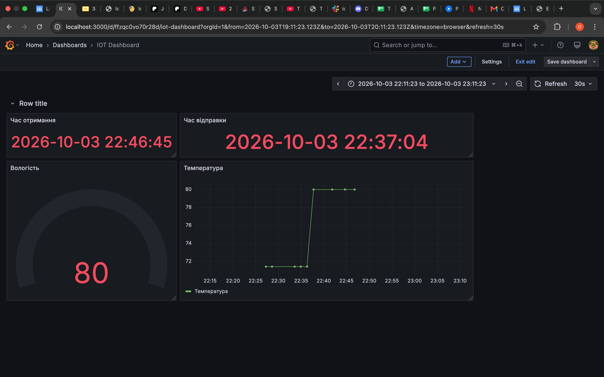
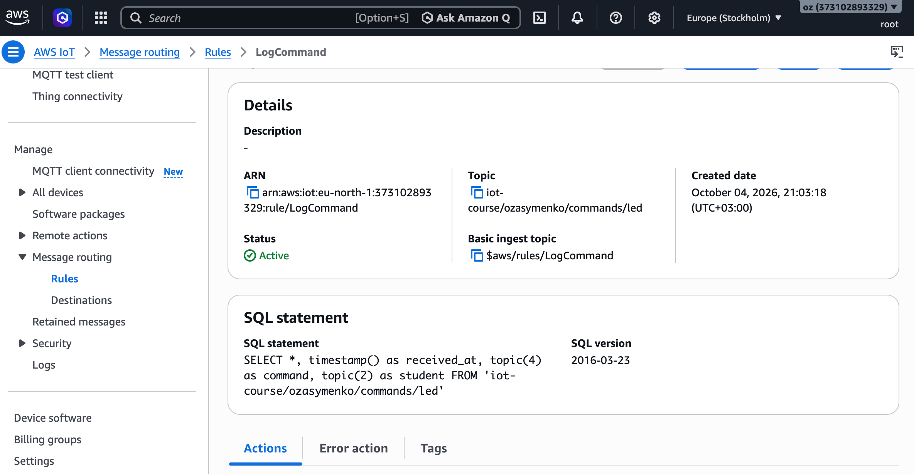
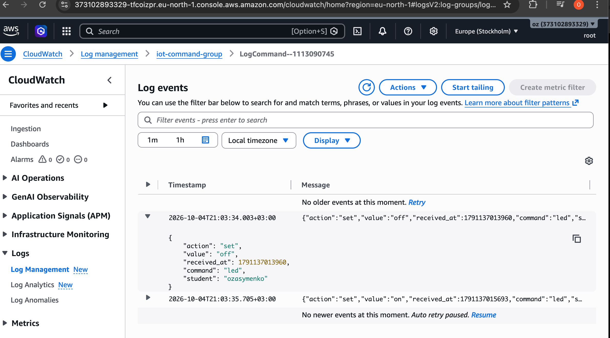

# Домашня робота 6 — FastAPI: бекенд, що не тільки читає, а й командує

Три частини, що працюють разом: пристрій публікує телеметрію в хмару,
бекенд її читає й показує, і той самий бекенд може послати пристрою команду
назад. Деталі кожної частини — у власному README (`ESP32/README.md`,
`FastAPI/README.md`, `HTML/README.md`); тут — загальна картина, список
ресурсів AWS і те, що ще не зроблено.

---

## Архітектура (обидва напрямки)

```
┌─────────────────┐
│  Браузер        │  HTML/index.html
│  [Увімкнути]    │
└────────┬────────┘
         │ POST /actuators/led  {"value":"on"}
         │ HTTP + CORS
         ▼
┌─────────────────────────────────────────┐
│  FastAPI  :8000                         │  ← GET /sensors/latest
│  main.py · iot_client.py · db.py        │  ← GET /sensors/history
└────────┬───────────────────────▲────────┘
         │ boto3 iot-data        │ boto3 query
         │ publish  QoS 1        │
         ▼                       │
┌─────────────────┐     ┌────────┴────────┐
│  AWS IoT Core   │     │  DynamoDB       │
│                 │     │  iot_telemetry  │
└────────┬────────┘     └────────▲────────┘
         │                       │
         │ topic:                │ Rules Engine
         │ .../commands/led      │ 
         │                       │
         │ MQTT over TLS :8883   │ topic: .../telemetry
         ▼                       │
┌────────────────────────────────┴───────┐
│  ESP32 (Wokwi)                         │
│  subscribe → LED D2  publish → 10 сек  │
└────────────────────────────────────────┘

```

Два незалежні канали: «вгору» (телеметрія: пристрій → Rule → DynamoDB →
FastAPI → браузер) і «вниз» (команда: браузер → FastAPI → AWS IoT →
пристрій). Жодна частина не знає адреси іншої — спільна точка це назва
топіка/таблиці, а не IP чи URL.

Третій, окремий споживач «вгору»-каналу — **Grafana**: вона не читає
DynamoDB/AWS напряму, а через ті самі `GET /sensors/latest` і
`GET /sensors/history` FastAPI, що й міг би будь-який інший клієнт. Деталі —
нижче.

---

## Структура репозиторію

```
ESP32/     — прошивка (PlatformIO, модулі: net, mqtt, dht, ldr, led, button)
FastAPI/   — бекенд: читання DynamoDB + публікація команд в AWS IoT
HTML/      — одна сторінка з двома кнопками (Увімкнути / Вимкнути)
grafana/   — dashboard.json для імпорту в Grafana
```

---

## Ресурси AWS

| Ресурс | Назва/ARN | Де використовується |
|---|---|---|
| Thing | `esp32-zasymenko` | ESP32, сертифікат X.509 |
| IoT Policy (на сертифікаті) | `Connect` (по `${iot:Connection.Thing.ThingName}`) + `Publish` на `topic/iot-course/ozasymenko/*` + `Subscribe`/`Receive` на `.../commands/*` | підключення, телеметрія і прийом команд — деталі в `ESP32/README.md` |
| Rules Engine | `StoreTelemetry` (→ DynamoDB), `TemperatureMoreThan28` (→ CloudWatch), `LogCommand` (→ CloudWatch) | записує телеметрію, лог температурних подій, лог команд |
| IAM-роль для Rule | `iot_write_db` | `dynamodb:PutItem` + запис помилок у CloudWatch Logs |
| DynamoDB таблиця | `iot_telemetry` (pk `device_id`, sk `received_at`) | зберігає телеметрію |
| CloudWatch Log Groups | `iot_db_store_errors`, `temperatureLogGroup`, `iot-command-group` | помилки Rule / температурні події / лог усіх команд |
| IAM-користувач (FastAPI, `.env`) | `dynamodb:Query` на `table/iot_telemetry` + `iot:Publish` на `topic/iot-course/ozasymenko/commands/*` | читання телеметрії й публікація команд із бекенда |
| MQTT топік команд | `iot-course/ozasymenko/commands/led` | FastAPI публікує, ESP32 підписується |
| MQTT топік ack | `iot-course/ozasymenko/commands/led/ack` | ESP32 публікує після виконання команди, підтверджуючи результат |

---

## Як запустити

### ESP32 (PlatformIO / Wokwi)

```bash
cd ESP32
cp src/secrets.example.h src/secrets.h   # заповнити своїми значеннями
# залити сертифікати, THINGNAME, AWS_IOT_ENDPOINT
pio run                                   
```
Запустити Wokwi симулятор


### FastAPI (:8000)

```bash
cd FastAPI
python -m venv .venv && source .venv/bin/activate
pip install -r requirements.txt
cp .env.example .env                      # заповнити AWS-ключами й регіоном
uvicorn main:app --reload
```

Swagger UI: http://127.0.0.1:8000/docs

### Grafana



Дашборд читає JSON напряму з FastAPI — без окремого проміжного API чи БД
на боці Grafana.

1. Встановити плагін **Infinity** (`yesoreyeram-infinity-datasource`):
   `grafana-cli plugins install yesoreyeram-infinity-datasource` (або через
   UI: Connections → Add new connection → Infinity), і додати джерело даних
   цього типу (URL можна лишити порожнім — він заданий у кожному панелі
   окремо).
2. **FastAPI має вже бути запущений на :8000** — Grafana ходить за живими
   даними в момент рендеру панелі, нічого не кешує сама.
3. Dashboards → Import → завантажити `grafana/dashboard.json`.

Чотири панелі, усі на `GET /sensors/latest` (три) і
`GET /sensors/history?minutes=30` (одна):

| Панель | Тип | Джерело |
|---|---|---|
| Час отримання | stat | `received_at` з `/sensors/latest` |
| Вологість | gauge | `humidity` з `/sensors/latest` |
| Час відправки | stat | `timestamp` з `/sensors/latest` |
| Температура | timeseries | `received_at`+`temperature` з `/sensors/history?minutes=30` |

Автооновлення — `refresh: 30s`, часове вікно — `now-30m` до `now`.

---


### HTML

Відкрити `HTML/index.html`, що звертається до backend-у на `http://localhost:8000`.
Натискаємо кнопку "Увімкнути".

На html-сторінці виводиться відповідь самого FastAPI (не MQTT, браузер
MQTT не бачить):

```
202
{"accepted":true,"value":"on"}
```

Це підтверджує лише доставку команди до брокера AWS IoT — не те, що
світлодіод реально загорівся.

ESP32 (`led.cpp`) отримує команду, вмикає світлодіод і одразу публікує
підтвердження назад у хмару — на окремий топік
**`iot-course/ozasymenko/commands/led/ack`**:

```
Serial: "[CMD] LED увімкнено"
MQTT → iot-course/ozasymenko/commands/led/ack:
{"value":"on","status":"ok"}
```

Побачити цей ack можна в AWS IoT Console → MQTT test client, підписавшись
на `iot-course/ozasymenko/commands/led/ack` — саме ця подія, а не `202` від
FastAPI, і є доказом, що світлодіод реально змінив стан.

---

## Лог команд (CloudWatch)

Окреме Rule `LogCommand` слухає топік команд і пише кожну вхідну команду в
CloudWatch Logs — незалежний від Serial Monitor і ack-топіка аудит того,
що саме й коли було надіслано пристрою.

### CommndLogRule



Rule `LogCommand`, `FROM 'iot-course/ozasymenko/commands/led'`:

```sql
SELECT *, timestamp() as received_at, topic(4) as command, topic(2) as student
FROM 'iot-course/ozasymenko/commands/led'
```

`topic(4)`/`topic(2)` беруть сегменти з назви топіка
(`iot-course/ozasymenko/commands/led` → сегмент 2 = `ozasymenko`, сегмент 4 =
`led`) — так до запису додаються `student` і `command` без хардкоду в самому
payload. Дія Rule — запис у CloudWatch Logs, група `iot-command-group`.

### CommandLogs



Результат у CloudWatch Logs (`iot-command-group` → `LogCommand--...`):

```json
{"action":"set","value":"off","received_at":1791137013960,"command":"led","student":"ozasymenko"}
{"action":"set","value":"on","received_at":1791137015693,"command":"led","student":"ozasymenko"}
```

Кожне натискання кнопки на HTML-сторінці лишає тут свій слід — ще один,
незалежний від ack пристрою, доказ того, що команда дійшла до AWS IoT Core.

Аналогічно з вимиканням світлодіода.

[Демонстрація роботи (запис екрана)](<ESP32/images/Screen Recording 2026-10-03 at 23.08.35.mov>)